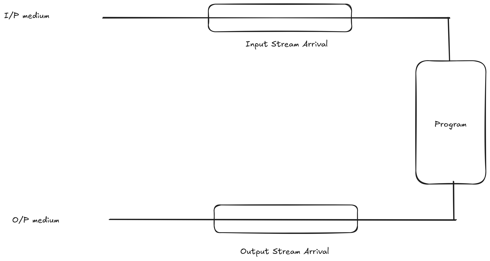

# IO Java

in terms of stream I/O divided into 
1. Console I/O
    where input is accepted from the keybord and output is displayed on the screen. 
2. Disk I/O   
    This I/O where io operation is carried out with respect to a file 
3. Port I/O
    Input is accepted from another computer and output is sent to another computer.

In each of these methods to have uniformity in programs the concept of streams is implemented . for each medium of I/O we have a different set of Classes to handle the I/O that is depending upon the medium we need to select an appropriate class system.out.println() internally implements streams. Java supports a predefined class PrintStream with methods `print();` and `println();` to handle console I/O. `out` is a static data member of the class printstream defined in the class system hence we use `System.out.println()` to print on the console.
The class printStream deals with inseritng data in the output stream which is then pass to the output medium.
The Scanner Class internally also uses the concept of stream.
Data from the input medium is not directly recieved In the program similarly output from the program is not directly displayed on the output medium. This is done so that the program should work irrespective I/O medium, data Input medium to the input stream is managed by Java with help of the operating system we simply extract the data from the input stream, similarly the ouput of the program is inseted in output stream which is then transported to the output the medum by java with the help of the operating system. 


<br/>

```
printf();
cout<<
`<<` - inspector

cin>>
`>>` - extractor
```
```java
try {
    InputStreamReader isr = new InputStreamReader(System.in);
    BufferedReader br = new BufferedReader(isr);
    br.read();
    br.readLine();
}catch(IOException e){

}

```


whenever we define a funtion or a method in java, we specifically annem the method and call the method by specifying its name 
an Interface with a single method or function is termed as a `functional  interface` lambda is the short representtaion of a functional interface. that is it allows us to call the function anonymously that is without specifying the name of the function. its basic syntax is giveen below 
```java 
() -> expression;
(par1, par2, ...) -> expresion;
(parameter) -> {body}

```

the parameter list can be ampty or contain multiple parameters the objective of lambda is to return a value immidiately in te expression if the ex[ression contains multiple statements , we can define a block within pair of curly braces. for multiple statements.


String does not support reverse but StringBuffer does

> ? Explore String builder `StringBuilder` <-> `StringBuffer`

## Generics in Java

Generics in Java are a feature that allows for a class, interface, or method to operate on objects of various types while providing compile-time type safety. This is achieved by using type parameters, which are placeholders for actual types that are specified when an instance of the class or an object of the interface is created.


A list of collection values in java is also considered as a stream of values this stream can be modified and processed using lambda method to process the content preciesly and with minimum code for this lambda is must we can apply stream() to any collection of elements and then use `filter()`, `map()`, `sorted()`, etc., also convert a string to a collection of desired type for example a list content can be eaisly converted in the set format (non repeatative values).

>? display a list of first 500 prime nos. on the users screen also store the prime numbers and the square of prime numbers in two separate list.
